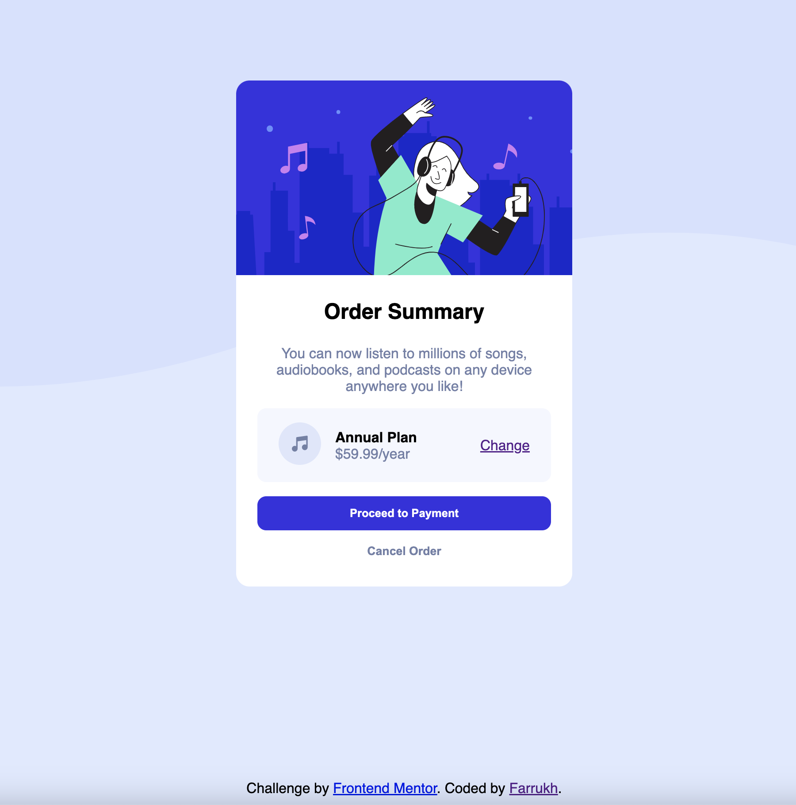

# Frontend Mentor - Order summary card solution

This is a solution to the [Order summary card challenge on Frontend Mentor](https://www.frontendmentor.io/challenges/order-summary-component-QlPmajDUj). Frontend Mentor challenges help you improve your coding skills by building realistic projects.

## Table of contents

- [Overview](#overview)
  - [The challenge](#the-challenge)
  - [Screenshot](#screenshot)
  - [Links](#links)
- [My process](#my-process)
  - [Built with](#built-with)
  - [What I learned](#what-i-learned)
  - [Useful resources](#useful-resources)
- [Author](#author)

## Overview

### The challenge

Users should be able to:

- See hover states for interactive elements

### Screenshot

### Links

- Solution URL: [Add solution URL here](https://github.com/Farrukh997/order_summary_component)
- Live Site URL: [Add live site URL here](https://farrukh997.github.io/order_summary_component/)

## My process

### Built with

- Semantic HTML5 markup
- CSS custom properties
- Flexbox

### What I learned

CSS flex styling model and grid style model.

### Useful resources

- [Mozilla Developer Network](https://developer.mozilla.org/) - This site helped me with HTML,CSS documentation.
- [Google](https://www.google.com) - As always google helped me with lots questions.

## Author

- Website - [Farrukh](https://webfelixdev.com/)
- Frontend Mentor - [@yourusername](https://www.frontendmentor.io/profile/yourusername)
- Twitter - [@felixMedov](https://twitter.com/felixMedov)
